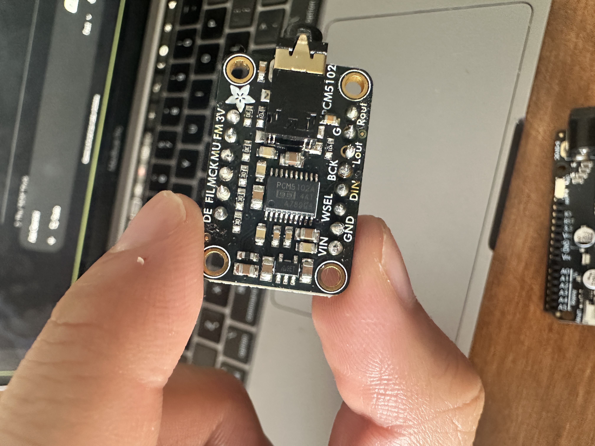
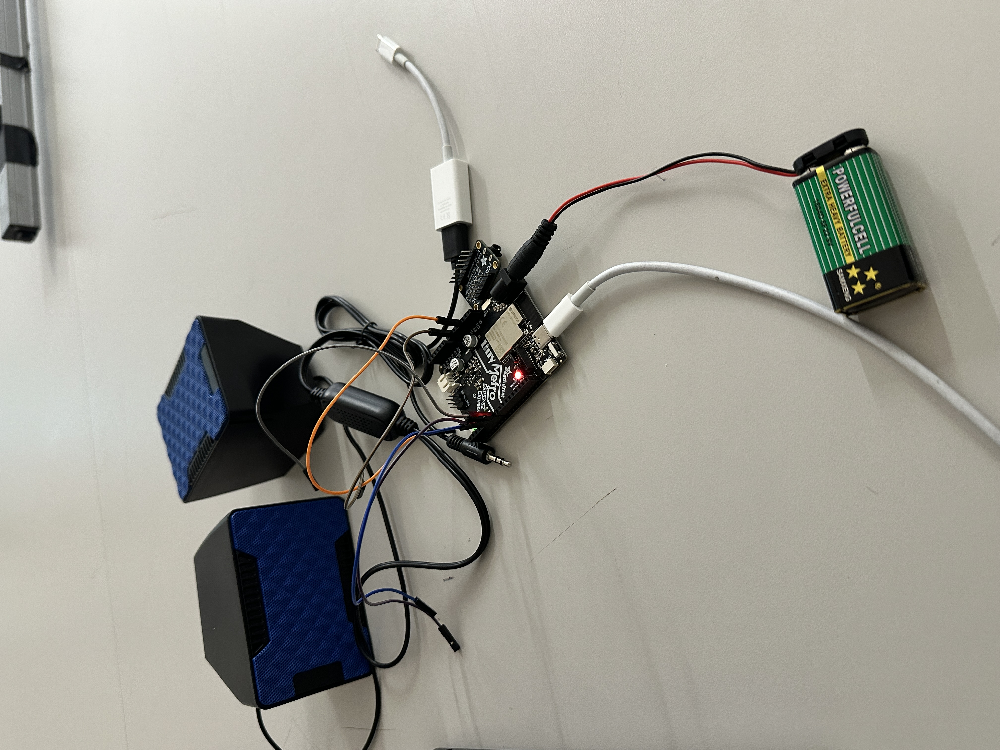
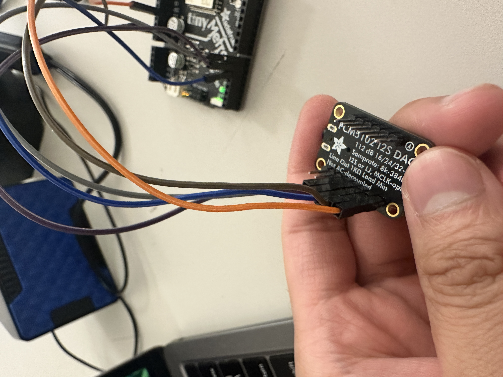

# Module 2 Reflection

## Project Description
This project is an interactive plant monitoring system built with an ESP32-S2 Express. It uses a capacitive moisture sensor to monitor plant health. The device plays audio files from an SD card, but as the soil moisture drops, the system introduces distortion to the music—serving as an audible "scream for help" to alert the user that the plant needs water.

My process for module 2 has been really unexpected. While I definitely know what I want to do, and I am sure what parts I need, almost in the middle, every time I am trying to work on the code, it then tells me that I need something else. This happened with the arduino uno where I then had to get a esp32, but now its telling me I need a MicroSD Breakout board because the thing I told it about earlier apparently needs more components, I been juggling this assignment with other ones, so theres not a lot of days I truly work on it, but having these unexpected obstacles has set me back. I was able to solder pretty efficiently, I was able to solder the header pins to the pcm5102 and I doubt I will have trouble soldering the plant monitor, I believe the only thing holding me back right now is this unexpected abrupt of information telling me I am either missing something or its actually not the way I thought, I guess this is a obstacle with using AI.

## Images

